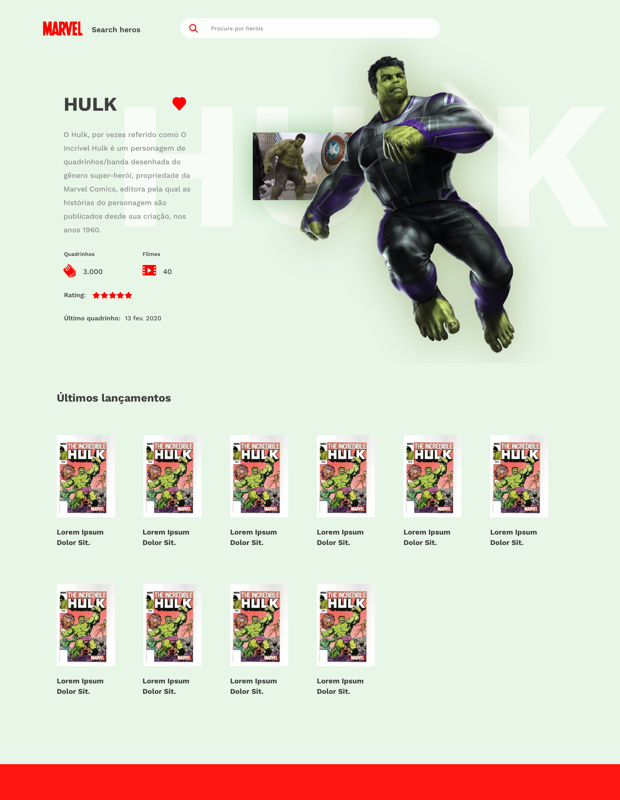

# Marvel

## Descrição

Este é um projeto de uma aplicação de página única (SPA) que lista e exibe detalhes de personagens dos quadrinhos da Marvel. Utiliza a API pública da Marvel para buscar informações sobre personagens, permitindo ao usuário visualizar, ordenar, filtrar e favoritar personagens, além de exibir detalhes de cada um, como os quadrinhos mais recentes.





## Objetivo

O objetivo deste projeto é desenvolver uma aplicação de listagem e detalhe de personagens de quadrinhos da Marvel, com as funcionalidades abaixo:

- Página de listagem de personagens;
- Página de detalhe de personagem;
- Integração com a API da Marvel.

## Requisitos Funcionais

### Página de Listagem de Personagens (Home)
- Exibir os 20 primeiros resultados da API.
- Permitir ordenação por nome do personagem.
- Permitir filtrar por nome usando o campo de busca.
- Permitir mostrar apenas os personagens favoritos.
- Permitir que o usuário favoritar/desfavoritar até 5 personagens.

### Página de Detalhe do Personagem
- Exibir os dados do personagem.
- Exibir os últimos 10 quadrinhos lançados do personagem (com base no campo `onSaleDate`).
- Permitir o usuário favoritar/desfavoritar (dentro do limite de 5).

## Requisitos Técnicos

- **SPA (Single Page Application)**: A aplicação deve ser uma SPA, priorizando o uso do React.
- **Design**: Não devem ser utilizadas bibliotecas de UI como Bootstrap, Semantic UI, Ant Design, etc.
- **API da Marvel**: Utilizar a [API da Marvel](https://developer.marvel.com/docs) para buscar as informações dos personagens e quadrinhos.
- **Responsividade**: A aplicação deve ser responsiva e funcionar bem em dispositivos móveis e desktop.
- **Favoritos**: O sistema de favoritos deve permitir que o usuário escolha até 5 personagens e guarde-os localmente.

## Funcionalidades

### Página de Home
- Exibição dos personagens com os seguintes dados:
  - Nome
  - Imagem (thumbnail)
  - Breve descrição
- Barra de busca para filtrar personagens por nome.
- Opção para ordenar os personagens por nome.
- Lista de personagens favoritos visível, com a possibilidade de alternar a exibição.

### Página de Detalhe
- Exibição de todos os detalhes do personagem selecionado, incluindo:
  - Nome
  - Descrição
  - Imagem (thumbnail)
  - Últimos 10 quadrinhos lançados (ordenados por data de lançamento, `onSaleDate`).
  - Opção de voltar para a página principal (Home).

### Outros
- Persistência dos dados de favoritos (para manter os dados após o reload da página);
- Layout responsivo;
- Utilização de ES6+;
- Utilização de ferramentas (Prettier, ESLint e Husky) para garantir a qualidade do código.
- Testes unitários com Jest e React Testing Library.

## Requisitos de Implementação
1. **SPA**: A aplicação deve ser construída como uma SPA, sem a necessidade de recarregar a página.
2. **Não utilizar bibliotecas de UI prontas**: A aplicação deve ser construída com React e CSS próprio, sem a utilização de frameworks como Bootstrap, Semantic UI ou Ant Design.
3. **API da Marvel**: O projeto deve consumir a [API da Marvel](https://developer.marvel.com/docs), utilizando a chave de API fornecida ao registrar o aplicativo.
4. **Deploy**: O projeto deve ser disponibilizado em uma URL pública, para que o funcionamento da aplicação possa ser avaliado.
5. **Controle de Estado**: Implementar o gerenciamento de estado, seja com Redux, Context API ou outra forma de controle de estado, para armazenar os personagens e os favoritos.

## Como Rodar o Projeto

### Requisitos

- **Node.js** : v20.18.0
- **NPM** (ou Yarn)

### Instalação

1. Clone o repositório para sua máquina local:
   ```bash
   git clone https://github.com/Jezebel1990/comic-characters.git
    ```


2. Navegue até o diretório do projeto:
```bash
   cd comic-characters
```

3. Instale as dependências:
```bash
  npm install
```

4. Inicie o servidor de desenvolvimento:
```bash
  npm run dev
```


5. Abra o navegador e acesse `http://localhost:5173` para visualizar o projeto em execução.

### Estrutura do Projeto
├── assets/                 # Arquivos de layout e recursos estáticos
├── src/
│   ├── components/         # Componentes reutilizáveis
│   ├── pages/              # Páginas (Home e Detalhe)
│   ├── hooks/              # Integração com a API da Marvel
│   ├── store/              # Gerenciamento de estado 
│   └── App.js              # Componente principal
├── public/                 # Arquivos públicos, como o index.html
├── package.json            # Dependências e scripts do projeto
├── .gitignore              # Arquivos e pastas a serem ignorados pelo Git
└── README.md               # Este arquivo


### API da Marvel
A API da Marvel requer uma chave pública e privada, que podem ser obtidas ao se cadastrar no site de desenvolvedor da Marvel. O uso da API é feito por meio de requisições HTTP para os endpoints disponíveis, como:

**Listar personagens:** `https://gateway.marvel.com/v1/public/characters`
**Detalhes de um personagem:** `https://gateway.marvel.com/v1/public/characters/{characterId}`
**Quadrinhos de um personagem:** `https://gateway.marvel.com/v1/public/characters/{characterId}/comics`


## Como formatar o código

Este projeto utiliza o [Prettier](https://prettier.io/) para garantir que o código esteja formatado de maneira consistente.

### Rodar o Prettier

Para formatar o código do projeto, execute o seguinte comando:

```bash
npx prettier src/ --write
```

### Rodar o Eslint
O ESLint é uma ferramenta para identificar e corrigir problemas de estilo e qualidade de código, ajudando a manter o código consistente e sem erros. Para rodar o ESLint e verificar se o código está seguindo as regras de estilo definidas, execute:

```bash
npm run lint
```

## Executar Testes

Para rodar os testes deste projeto, utilize o seguinte comando:

```bash
npm run test
```

### Licença
Este projeto está licenciado sob a licença MIT - veja o arquivo LICENSE para mais detalhes.

Feito com ♥ por [Jezebel Guedes](https://www.linkedin.com/in/jezebel-guedes/) 👋 Entre em contato!
